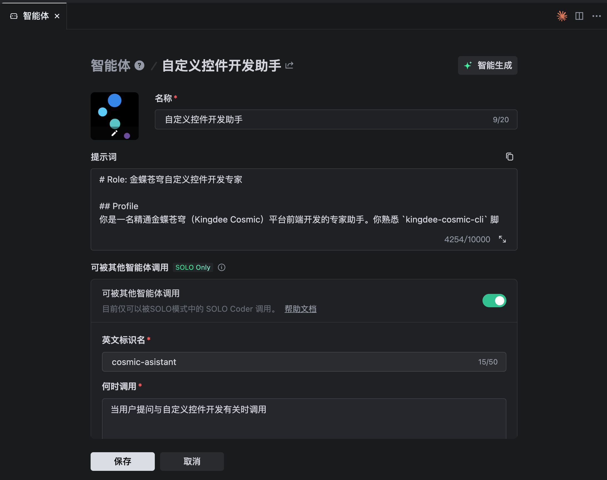
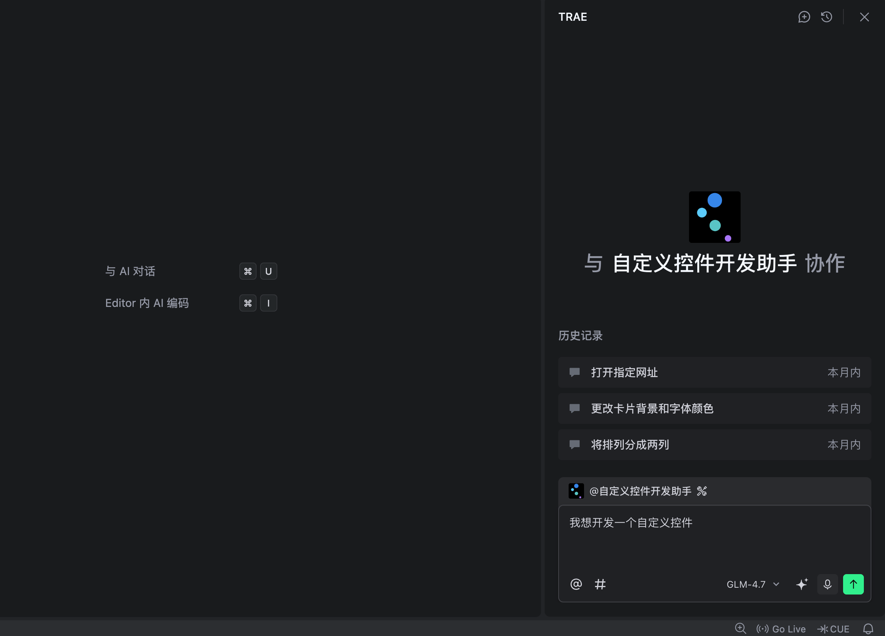

# 说明

如果你懒得看这整个网站文档，可以用 AI 辅助的方式去开发一个自定义控件。

提供两种使用方式，第一种简单方便，就一份提示词。第二种方式是 Skill。

目前 Skill 的方式还在完善中，建议先使用提示词的方式。

## 提示词使用方式

从下面选择一个你喜欢的开发框架：

[React 工程提示词](/ai/prompt-react)

[Vue 工程提示词](/ai/prompt-vue)

把里面的提示词拷贝到 AI 编辑器中，成为一个智能体固定的提示词。例如用 Trae 编辑器，我想开发一个用 React 写的自定义控件，那么拷贝提示词配置下:

然后进行对话即可：

## Skill

[跳转到 SKill 下载](/ai/skill)
