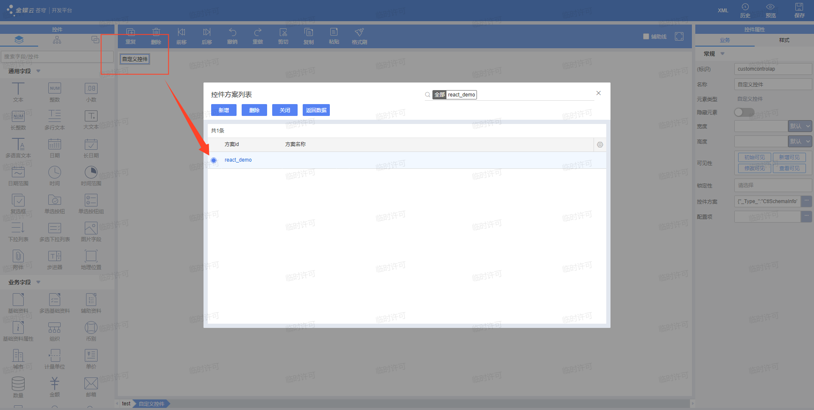
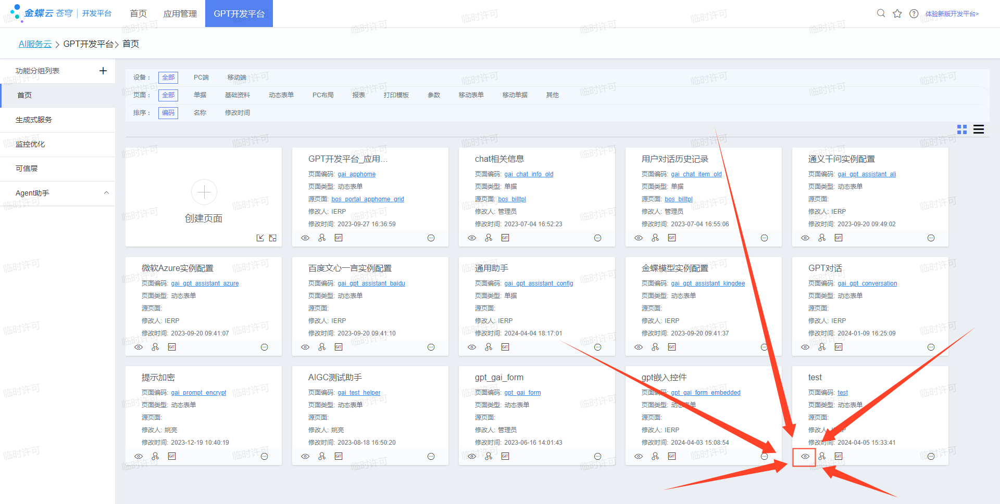
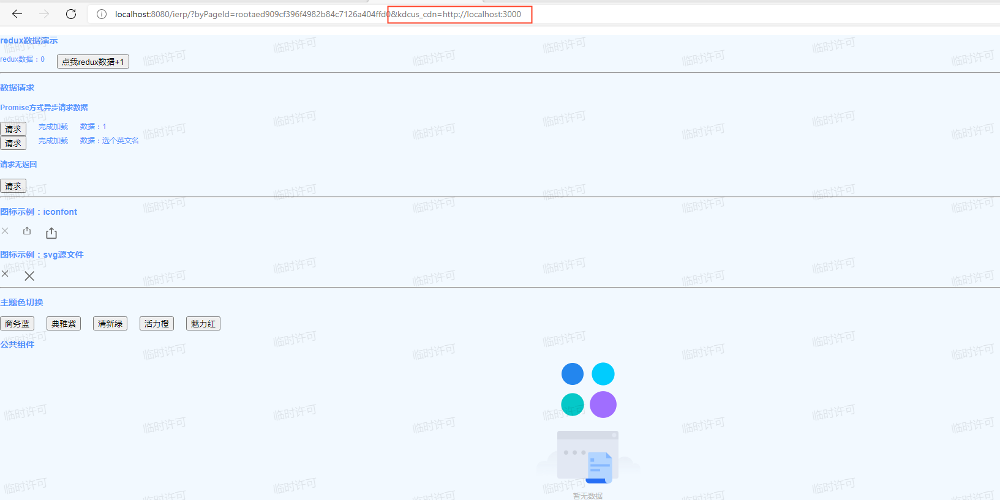

# 苍穹预览模式

执行指令：

```bash
npm run dev
```

你会看到根目录中出现一个名为 `cache` 的新文件夹，其中的文件是 Webpack 在开发模式下将打包到内存中的二进制文件转换后复制到此处的。

如何预览？

首先我在苍穹的开发平台上把自己的自定义控件注册上，例如我的 React18 起步工程例子

> 这块自定义控件注册金蝶苍穹社区上有其他人的文档教学，我这里就不多说了，推荐两个系列文章：
> [自定义控件系列（持续更新）](https://vip.kingdee.com/article/150626162270913792?productLineId=29&lang=zh-CN)、
> [360°教你搞定“自定义控件开发”](https://vip.kingdee.com/article/315085275967999232?productLineId=29&isKnowledge=2&lang=zh-CN)
> 如果链接失效了，请从右上角的社区链接进入，然后自行搜索~



保存后退出！从这里 "眼睛" 预览按钮点进去预览：



此时我们看不见自定义控件，需要在地址后面拼上 `&kdcus_cdn=http://localhost:3000` ，然后刷新一下，自定义控件就出现了：



当我们修改开发代码的时候，保存，工程会自动更新 `cache` 里的文件，目前体验速度和平常开发没啥区别。然后到页面上刷新下，界面就更新了。

注意！如果后端环境更新了，需要重新从 "眼睛" 预览按钮那里重新打开页面，不然页面关联到的后端资源还是旧的。

当然具体想怎么浏览效果还是视情况而定，我只是提供了一个简单的方法~。

**这开发、联调体验嗖嗖的提升！😝**

如果想修改端口号，可以在 `app.config.js` 中修改 `DEV_CACHE_PORT`