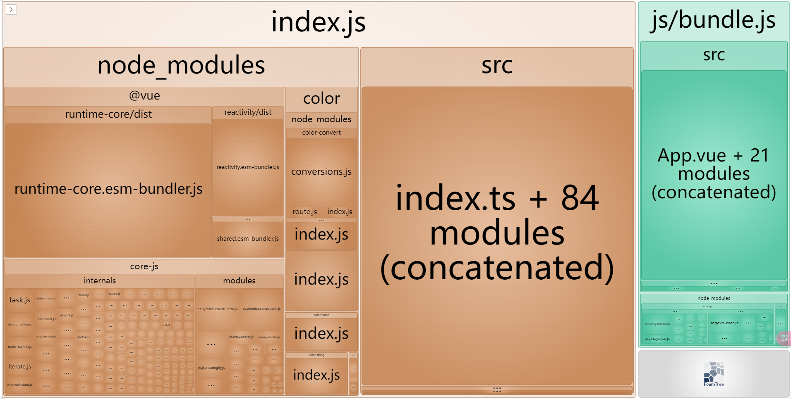

# 生产打包

最终用于上生产的文件。

指令:

```bash
npm run build
```

根目录会生成一个 `build` 文件夹，里面就是生产环境需要用到的文件。

# 产物分析

执行指令：

```bash
npm run analyzer
```

执行完后，会根据生产模式的产物去分析每个文件的资源容量占用情况，自动打开一个页面，展示分析结果。



可在全局配置中修改启动的端口 `ANALYZER_PORT`。